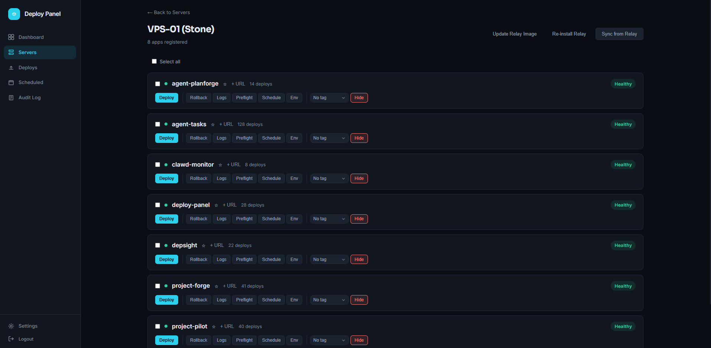

# deploy-panel

Web control panel for VPS deployments, paired with [agent-relay](https://github.com/LanNguyenSi/agent-relay).

[](https://github.com/LanNguyenSi/deploy-panel/actions/workflows/ci.yml)

deploy-panel is a Next.js + Hono app that drives a fleet of VPS servers running [agent-relay](https://github.com/LanNguyenSi/agent-relay). It tracks servers, apps, and deploy history in PostgreSQL via Prisma, and proxies deploy / rollback / logs / preflight requests to each VPS's relay over HTTP. Built so a small team (or solo operator) can ship to a handful of boxes without juggling SSH tabs.



## Key features

- Web dashboard for a fleet of VPS servers: per-app health badges and Deploy, Rollback, Logs, Preflight, Schedule, and Env actions.
- `/api/v1` REST API for CI/CD (deploy, rollback), authenticated with a `PANEL_TOKEN` or a `dp_` API key.
- Deploy and rollback history recorded in PostgreSQL via Prisma, per server, plus a panel-wide audit log (deploys, rollbacks, server/app changes, logins, API key issuance/revocation).
- Per-app secrets stored encrypted in the panel's own database (not in an untracked `.env` on the VPS), gated by a required-env check that hard-fails a deploy if a declared key is still unset.
- GitHub OAuth login, plus an identity-broker flow for provisioning users from a trusted upstream (e.g. [project-pilot](https://github.com/LanNguyenSi/project-pilot)).
- MCP server so an AI agent can drive deploys directly; see [mcp/README.md](mcp/README.md).
- `scripts/smoke-check.sh` to verify auth, DB-backed queries, and fleet reachability against a live instance.

## Quick start

Prerequisites: Node.js 20+ (`backend/package.json` engines), Docker with the Compose v2 CLI plugin (`docker compose`), and `make`.

```bash
git clone https://github.com/LanNguyenSi/deploy-panel.git
cd deploy-panel
cp .env.example .env

npm install
docker compose up -d db                          # Postgres only, published on 127.0.0.1:5433
npx prisma generate --schema backend/prisma/schema.prisma
set -a; . ./.env; set +a                         # host-run processes below don't load .env themselves (direnv is an alternative)
npx prisma db push --schema backend/prisma/schema.prisma   # run from the repo root

make dev                                          # backend on :3001, frontend on :3000, both hot reload
```

`make dev`, `make db-push` and `cd backend && npx prisma ...` do not read `.env`; export it first as above. Details: [docs/configuration.md](docs/configuration.md#local-development).

Open http://localhost:3000, add a server (host + `relayUrl` + optional `relayToken`), hit "Test connection", then deploy from the app list.

`make setup` (install, then `make docker-up` for the full db + backend + frontend Docker stack, then Prisma generate/push) exists as an alternative, but its Docker stack is not what `make dev` above needs: the containerized backend requires `APP_SECRETS_KEY` set in `.env` to pass its startup validation (commented out in `.env.example`, so `make setup` fails there on a fresh clone), and if that is fixed, the containerized frontend then occupies host port 3000, the same port `make dev` binds on the host. Use `docker compose up -d db` for local dev as shown above, or see [docs/configuration.md](docs/configuration.md#docker-deployment) to run the full stack in containers instead of on the host.

## Usage

Dashboard, fleet overview:

```
# example output
Servers   3 online / 0 offline / 0 no-relay
Apps      11 healthy / 1 unhealthy / 0 deploying
Recent    web-prod      success    2m ago    (a1b2c3d -> e4f5g6h)
          api-staging   success    14m ago   (9e8d7c6 -> 5b4a3c2)
          worker-prod   failed     1h ago    (timeout reaching relay)
```

API v1 deploy from a CI job:

```bash
curl -X POST https://panel.example.com/api/v1/deploy \
  -H "Authorization: Bearer $PANEL_TOKEN" \
  -H "Content-Type: application/json" \
  -d '{"server": "srv_abc", "app": "web-prod"}'
```

## Documentation

| If you want to... | Read |
|------|------|
| Understand the layers (frontend, backend, relay proxy, data model) | [docs/architecture.md](docs/architecture.md) |
| Configure env vars, ports, sessions, CORS, Docker deployment | [docs/configuration.md](docs/configuration.md) |
| Enable GitHub OAuth or the identity-broker registration flow | [docs/configuration.md#authentication](docs/configuration.md#authentication) |
| Call the REST API (panel UI endpoints + `/api/v1` for CI/CD) | [docs/api.md](docs/api.md) |
| Drive deploys from an AI agent (MCP server) | [mcp/README.md](mcp/README.md) |
| Deploy from a GitHub Actions workflow | [action/README.md](action/README.md) |
| See the VPS daemon deploy-panel talks to | [agent-relay](https://github.com/LanNguyenSi/agent-relay) |

## Development

```bash
make dev            # backend + frontend, hot reload (see Quick start above for one-time setup)
make build          # build both workspaces
make setup          # full Docker stack instead of make dev: needs APP_SECRETS_KEY in .env and .env exported; its frontend container conflicts with make dev on port 3000
make docker-up      # bring up the full Docker stack (db + backend + frontend)
make docker-down    # stop the Docker stack
make db-generate    # prisma generate
make db-push        # prisma db push (apply schema); export .env first
make clean          # remove dist + node_modules
```

Workspaces: `backend/` (Hono + Prisma + Zod, Node 20+) and `frontend/` (Next.js 15, React 19). Shared root `package.json` declares both as npm workspaces.

After deploying to a real environment, run the smoke check to verify auth, Prisma-backed queries, and fleet reachability against the live instance:

```bash
DEPLOY_PANEL_URL=https://deploy-panel.example.com \
PANEL_TOKEN=... \
./scripts/smoke-check.sh
```

Exits 0 on success. Unlike `/api/health` (which only proves the Hono process is up), this script exercises real DB queries, so schema drift surfaces immediately. Requires `curl` and `jq`.

## License

[MIT](LICENSE)
